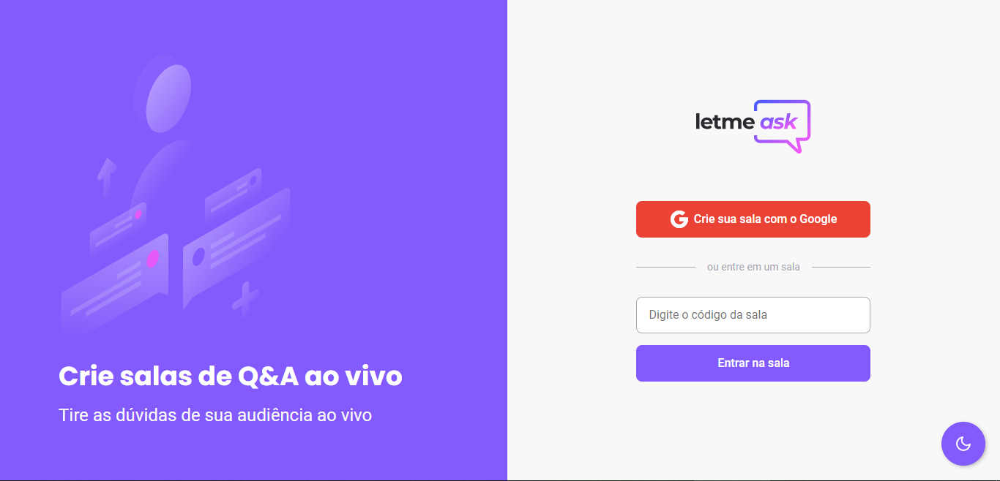
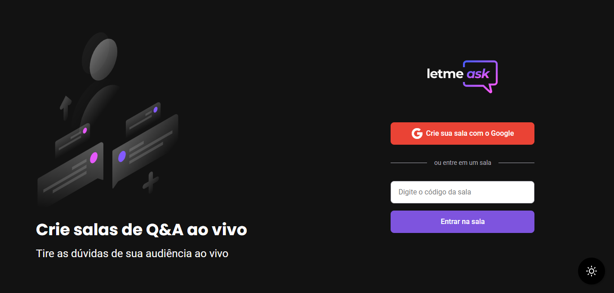
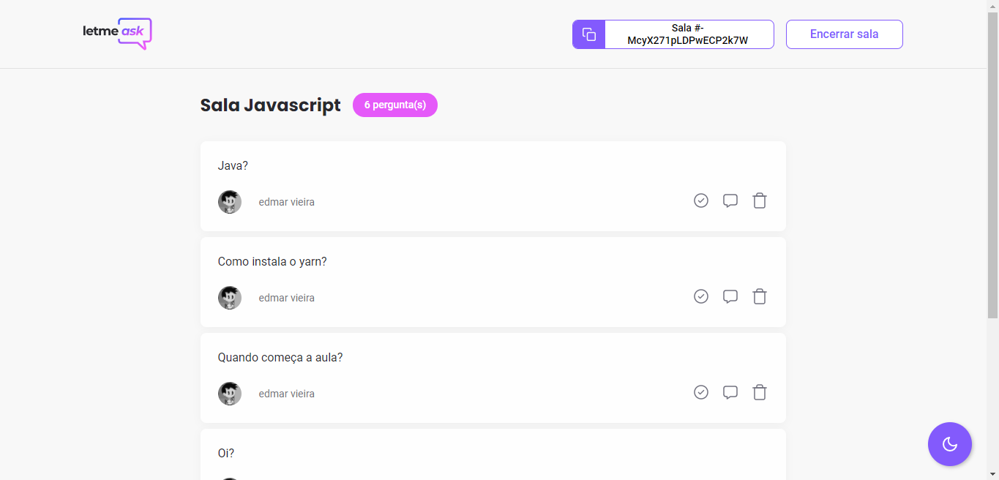
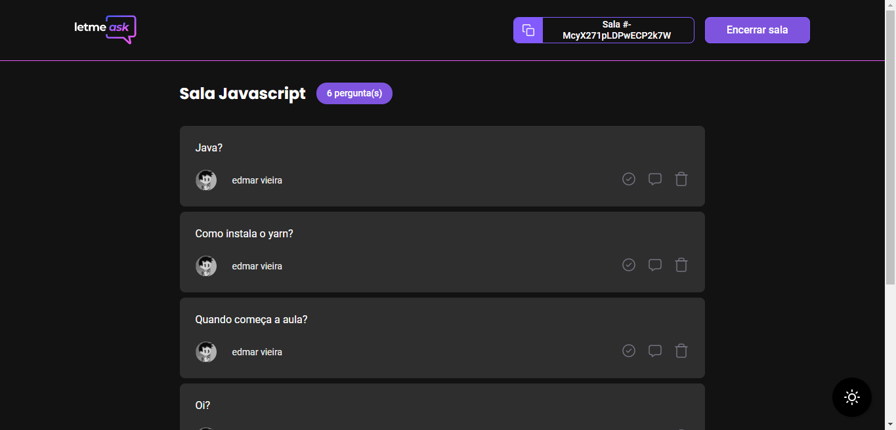

<h1 align="center">
  
</h1>

 

  

  

## ✨ Tecnologias

Esse projeto foi desenvolvido com as seguintes tecnologias:

- [React](https://reactjs.org)
- [Firebase](https://firebase.google.com/)
- [TypeScript](https://www.typescriptlang.org/)
- [SASS](https://sass-lang.com/)

## 💻 Projeto

O Letmeask é um app onde os usuários podem entrar ou criar suas próprias salas para registrar suas dúvidas durante eventos ao vivo organizados por educadores, dessa forma é bem mais fácil e prático para os participantes tirarem o máximo de proveito do evento.

  

  

## 🔖 Layout

Você pode visualizar o layout do projeto através [desse link](https://www.figma.com/file/u0BQK8rCf2KgzcukdRRCWh/Letmeask/duplicate). É necessário ter conta no [Figma](http://figma.com/) para acessá-lo.

## 🚀 Como executar

- Crie e configure o projeto no Firebase
- Instale as dependências com `yarn`
- Execute o projeto localmente com `yarn start`

Agora você pode acessar [`localhost:3000`](http://localhost:3000) do seu navegador.

Feito durante o aevento NLW Together, organizado pela Rocketseat, [Link da comunidade!](https://discordapp.com/invite/gCRAFhc)